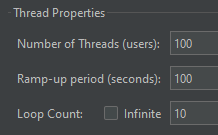
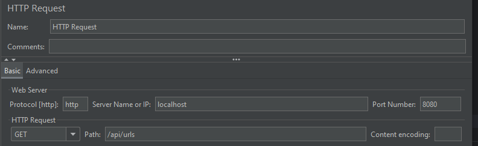
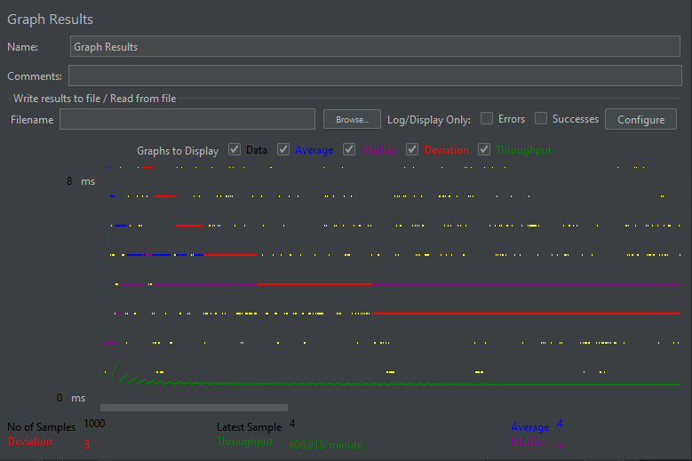

# SpringBootTask

Link on the test task: https://github.com/avito-tech/auto-backend-trainee-assignment

Various technical assignments: https://qna.habr.com/q/762121

### Running project

Run project with 'docker-compose up' command

### Results of load testing

We select Apache JMeter tool.

#### Parameters:

And then we perform get-request "http://localhost:8080/api/urls":

We have quite high performance of server:
- "Throughput": 606.913/minute 
- "Deviation": 3:

